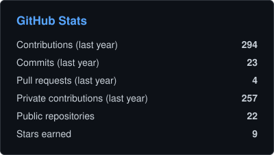
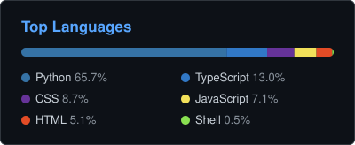

# 👋 Hi there! I'm Leandro Colombo

**AI Engineer @ ADCentral** · Data pipelines · Conversational agents · AI automation · 📍 Buenos Aires, Argentina

---

## 🧑‍💻 About me
- 🤖 **AI Engineer at ADCentral** (since October 2025), driving AI automation solutions for business and operations.
- 📊 Previously **Data Analyst at RunMedia** (an ADCentral subsidiary) and **Data Engineer at Remitz Inc.**
- 🔗 I build **data pipelines, conversational agents, and ETL flows** that connect data, models, and decisions.
- 🎓 Studying **Systems Analysis at ORT**, with a **Data Engineer / Data Science degree from CoderHouse**.

---

## 🛠️ Stack

**Data & Cloud**

**AI & Automation**

**Dev & Web**

---

## 🚀 What I'm working on
- 🤖 **[ASTRA-TRADING](https://github.com/LeandroColombo111/ASTRA-TRADING)**: algorithmic trading bot for crypto perpetuals (OKX)
- 📊 **[okx-perp-backtest](https://github.com/LeandroColombo111/okx-perp-backtest)**: backtesting engine with real funding settlement, realistic slippage, fees, liquidations, Monte Carlo and walk-forward analysis
- 🧠 AI-driven automation for data and marketing processes at ADCentral
- 📈 **[calculadora-ahorro](https://github.com/LeandroColombo111/calculadora-ahorro)**: savings-vs-inflation dashboard

---

## 🎓 Education & Certifications
| | Program | Institution | Final project |
|---|---|---|---|
| 🎓 | Systems Analysis (in progress) | ORT | |
| 📜 | Data Engineering | CoderHouse | [Data_Engineer_Coderhouse](https://github.com/LeandroColombo111/Data_Engineer_Coderhouse) |
| 📜 | Data Science | CoderHouse | [CO2 emissions ML analysis](https://github.com/LeandroColombo111/Analysis-of-CO2-emissions-using-ML) |

---

## 📈 GitHub Stats

  
  

---

## 📫 Get in touch
- LinkedIn: [in/leancolombo](https://www.linkedin.com/in/leancolombo/)
- Email: [leandronahuelcolombo@gmail.com](mailto:leandronahuelcolombo@gmail.com)
- GitHub: [LeandroColombo111](https://github.com/LeandroColombo111)
